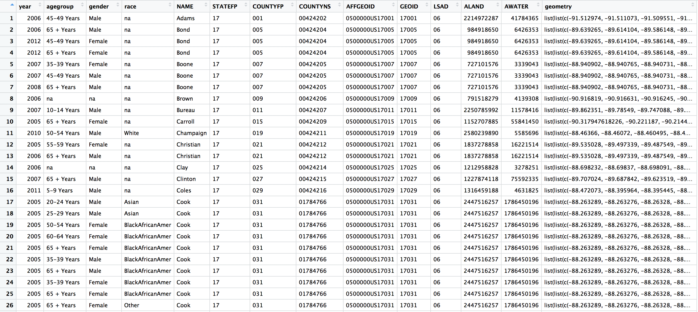
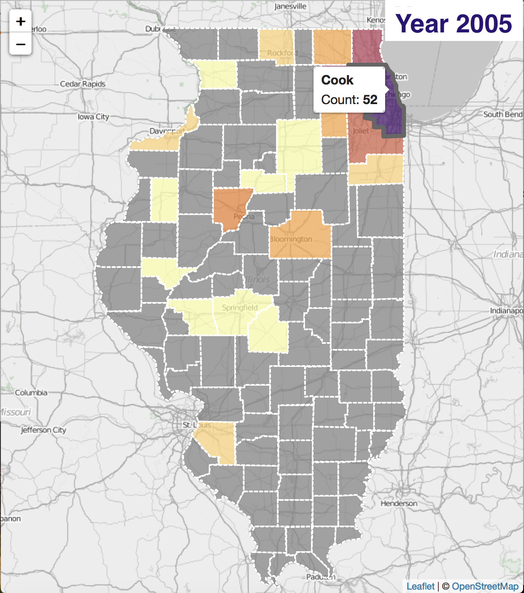

## Introduction

  In the past few weeks, a group of us worked together on our group project about [West Nile Virus (WNV) counts in Illinois](https://data.illinois.gov/dataset/6ff64c62-b424-44bc-8860-fefffd1dd191/resource/fb04f7ce-66bb-48a9-b463-d72a933dd9d4/download/data) using an interactive map and visually interactive app presentations [1]. WNV is a virus that is most commonly transmitted to humans by mosquito bites. From 1999 to 2015, there were a total of 43,937 confirmed or probably cases documented in the United States. In particular, there was a large multi-state outbreak in 2012, where 43 statess reported a higher incidence of disease compared to the median from 2004 to 2011 [2]. Among those infected by WNV, 1 out of 5 develop a fever or other symptoms, and 1 out of 150 develop more serious symptoms, such as swollen lymph nodes or encephalitis [3, 4]. The primary goal of our project was to use epidemiological and demographic information, including case count, age group, gender, race, ethnicity, and county, to map patterns of WNV human cases in Illinois from 2005 to 2012. We immediately recognized a few weaknesses with the dataset, including inability to distinguish between those who simply contracted WNV versus those with neurological symptoms, and an inability to discern the mode of transmission, whether it be from mosquito infection, blood transfusion, organ transplantation, or transplacental transmission.
Furthermore, we created an app to add interactive functions through an embedded dashboard. With this [app](https://wendtke.shinyapps.io/Illinois/), it is possible to manipulate the data on the map by changing different parameters (i.e., year and gender) to observe respective county-level counts.The primary goal of our project was to use epidemiological and demographic information, including age, gender, counts, ethnicity, location, and race, to map WNV in Illinois from 2005 to 2012. When all four members of our group started working on this project, we were concerned about how to delegate the tasks successfully, how to ensure that our map and app achieved the standard that would allow us to present to the rest of class, and how to incorporate more of what we learned in making the interactive map and app. This project does fit into the broader scope of WNV research by potentially engaging the public in the discussion of the prevalence of WNV and possible prevention strategies.

## Project Participation

  When we were first assigned this project, half of us were unfamiliar with the topic and the importance of epidemiology, in general, since we all come from different fields of research. To note, both Nichole and Randy are Public Health/ Epidemiology master's students, so they were able to help decide on a dataset that would help explore epidemiology-related research topics. Conducting a search of epidemiological data on WNV exposed us to more information about this virus and its effect on the human population. That gave us a better understanding of the importance of developing this interactive app and providing it to the public to increase awareness of WNV. Through this process, we strengthened our ability to search for suitable datasets using the web browser. We searched for accessible federal, state, and local public health data on WNV. That provided us with the opportunity to see how such data are organized, and how plots and graphs are presented, which helped us decide on our own visual presentation. For example, the plots and graphs on the government website [the Centers for Disease Control and Prevention-CDC](https://www.cdc.gov/westnile/statsmaps/preliminarymapsdata2018/incidencestate-2018.html) follow the guidelines for creating effective plots and graphs, such as using a clear, meaningful labels and providing useful references. However, many of those data were inaccessible to us. Being able to see how the information we learned about in class is put into practice encouraged us to proceed with our own project in similar ways. 

## Data Preparation and Creation of the Interactive Map

  First, we cleaned up the raw data, for example,we used `sub()` to clean up the county names. Then we `full_join`ed demographic and census data (like shown in Table 1 below). We also created counts of WNV per county, spatial data per county, and merge county counts with spatial data. Finally, we merged Illinois WNV counts and Illinois counties on to a blank map highlighted by county name and boundary, and added `leaflet` arguments, specifically `addProviderTiles` and `addPolygons`. An example of the interactive map of 2005 is shown in Figure 1 below.

#### Table 1. Joined demographic and census data 
 
\newpage
Figure 1. Interactive map of 2005

\newpage

## Technical Issues

  Throughout this project, we encountered several technical problems. In addition to seeking help from our instructor to resolve these issues, we also utilized the issues section on GitHub to update issues and problems we encountered to troubleshoot in real-time.

  The first major problem we encountered dealt with inconsistent leaflet plot rendering. On one computer, the written code worked to render a plot of Illinois with county borders and county names as popups. Unfortunately, this map did not render properly on all computers. In trying to diagnose the problem, we found that the `addPolygons()` call of this code was the portion likely causing our issue. We considered several suggestions, including a change to our `sf` class to `sp`, restarting RStudio, and updating versions of all packages and RStudio.  We had no solution to this problem for some time, and did plan to proceed with the creation of our app in hopes that the correct rendering would happen at a different stage of the project. Interestingly, our solution to this issue was revealed within the troubleshooting process of another issue.
As we tried to fill polygons based on our demographic indicators, our spatial data did not match the counties. To solve this issue, the `crs` was set to 4326, and we reordered our merged dataframes to ensure that the spatial information was aligning with the correct county. By properly ordering our demographic data frame and our spatial information, this issue was solved, and our map outputted correctly on all computers. We were happy to solve this issue and continue into the Shiny creation portion of this project.   

  After the first draft of the user interface (UI) was created, there was an issue with having the widgets line up in an aesthetically pleasing manner. The issue arose from trying to have two `box()` widgets that could not fit horizontally next to each other. Additionally, there was an issue with the order of the widgets making it impossible to wrap around. This was resolved with two changes. The first fix was made by changing the `box()` function into another `fluidRows()` option. This allowed the widgets to wrap to the following row, and it erased the grey box that was overlaying the first of the 3 demographic widgets. The second fix was accomplished by reordering the widgets so that the year widget, which was a `sliderInput()` widget, got its own row.  

  After these changes were done, we realized that, since we are using a state-level dataset spanning 8 years, filtering by more than one demographic indicator would not lead to useful information about the distribution of WNV. Therefore, we changed our approach for the UI to having selection of demographic indicators be done via `radioButtons()` to limit the filter to one. At this point, Randy shared with the group that he has experience with HTML, so he was asked to redesign the UI with HTML-injected `radioButtons()`. However, there was an issue successfully injecting HTML code into the `radioButtons()` design; after consultation with our instructors, it was determined that using the `choice()` designation was ill- advised and that `choiceNames()` and `choiceValues()` were successful options. At this point in time, we also reduced the number of demographic filtering options to only gender; as discussed previously, the small dataset constrained the level of filtering options available, and we ultimately decided that understanding patterns of WNV by gender and year might be the most informative.

## Logistical Challenges

  Our biggest challenge was to find a dataset that would allow us to gather all the epidemiological information in a format that would be easy to navigate in R. We started with some of the large federal organizations, such as the Centers for Disease Control and Prevention (CDC); however, we were unable to find the source of the raw data to download. For example, the WNV data provided by the CDC were already presented in a map or a plot to show the counts in a specific location, or the counts were only depicted using one variable, such as age, which did not fit the goal of our project. Our instructor then suggested that we look at some state-level and local-level public health departments. Our initial aim was to find WNV epidemiological data for Larimer County, CO. However, we did not find any available raw data to retrieve. We did find WNV data for the state of Illinois, which contained information that we hoped to integrate into our map and app. In the end, that is the dataset we chose.  

  Once we chose our data, the major discussion dealt with the analysis of NA values vs. 0 values within our dataset. In the original data, there are no 0s, simply NAs. While we could have changed these NA values to 0, we decided to leave them untouched because it is possible that data was not collected and the case counts are unknown and not 0. To us, NA is more descriptive and accurate than 0. 

  Another challenge we faced was the absence of some of our team members due to other school-related commitments, tasks, and duties. In the beginning, it was challenging in keep all the team members updated and to discuss the goals and plans we had for this project. However, we were able to handle that issue by delegating tasks to different people based on their availability, expertise, and preferences. Team members who missed more classes towards the end of the project helped clean and explore the dataset to prepare it to merge with the map. At the same time, another member started preparing the interactive map of Illinois. Those who missed classes at the beginning of the project worked on drafting the report and preparing the presentation. 

## Future Directions and Changes

  Overall, we appreciated our instructors' suggestions. The suggestions given helped us capture our aims for this work, better organize our project, troubleshoot the problems we encountered.  

  If given more time, there are improvements we would make to our project. Had we intended to maintain this app, we would have carried through our original dataframe with all county, case, gender, and year combinations from its creation to the app. We also would have cleaned our GitHub repository by consolidating files and deleting unnecessary code. Due to the immense time spent troubleshooting for this project, we decided to leave our functional code unaltered within the `app.R` file at this time. We understand how this improvement would result in a cleaner, more reproducible version of our code. We also recognize that our current `helper.R` file contains code that we did not end up needing. Rather than moving needed code to a new `helper.R` file, we decided to comment out the unused code. We believe this accurately charts our progress and explains the process we went through to ultimately create this app. Had this not been a graded school assignment, we would have created a new file without these comments.  

  To conclude, we appreciated working through this assignment. In doing so, we not only enhanced our current skill sets but also learned a great deal involving `leaflet` and `Shiny`. 
  
  After presented the project on Monday, we also recognized a few more things to improve. We will take these comments into consideration for future projects: 1) insert color legend to the interactive map in order to present the color coded counts; 2) change the map color scale to a logarithmic color scale to avoid the similar color schemes between the selected area and the background map; 3) look for denominator data of WNV in order to show the county level WNV counts in comparison to the country level.

\newpage

## References

1. 2005 to 2012 Inquery WNV Data. "State of illinois Data Portal". Retrieved from https://data.illinois.gov/dataset/6ff64c62-b424-44bc-8860-fefffd1dd191/resource/fb04f7ce-66bb-48a9-b463-d72a933dd9d4/download/data 

2. The Centers for Disease Control and Prevention. "West Nile Virus and Other Arboviral Diseases - United States, 2012." 
Morbidity and Mortality Weekly Report (2013): 513-517

3. Lanciotti, R. S., et al. "Origin of the West Nile virus responsible for an outbreak of encephalitis in the northeastern United States." Science 286.5448 (1999): 2333-2337

4. The Centers for Disease Control and Prevention. "West Nil Virus." (2015)

