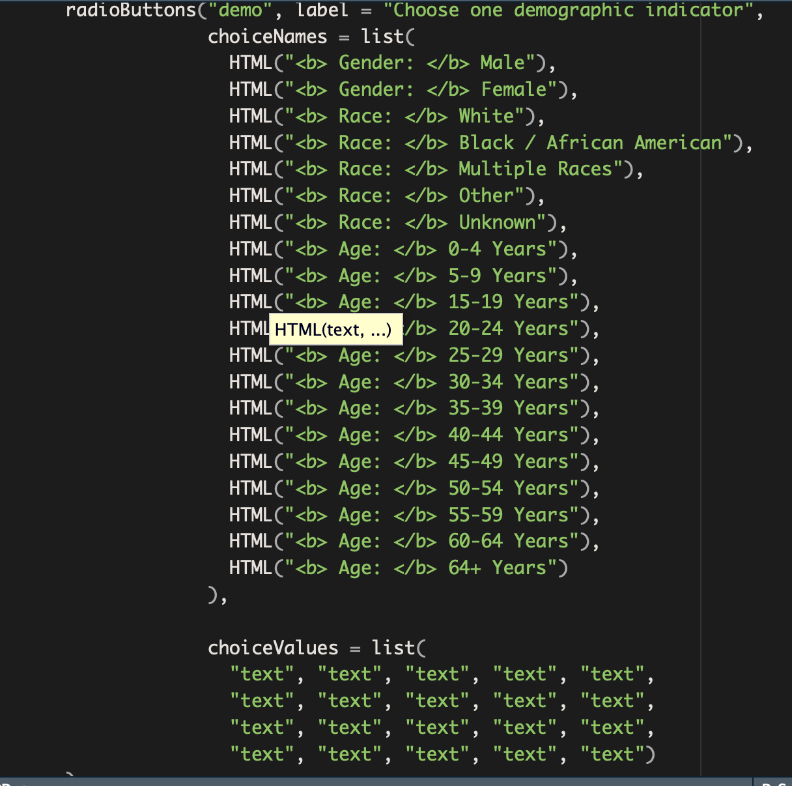
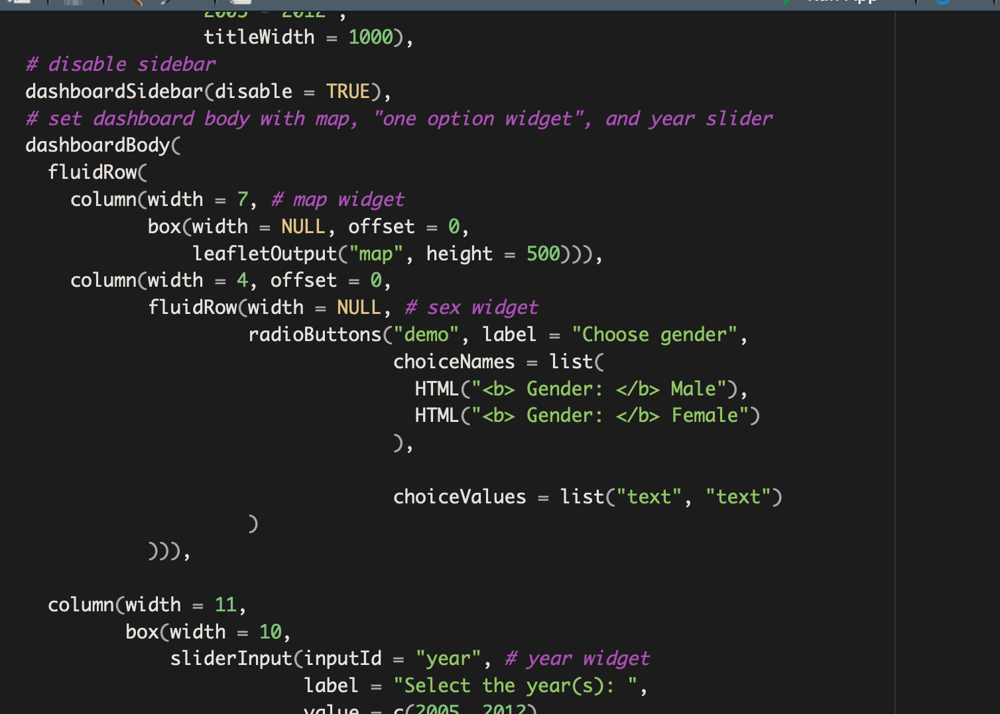
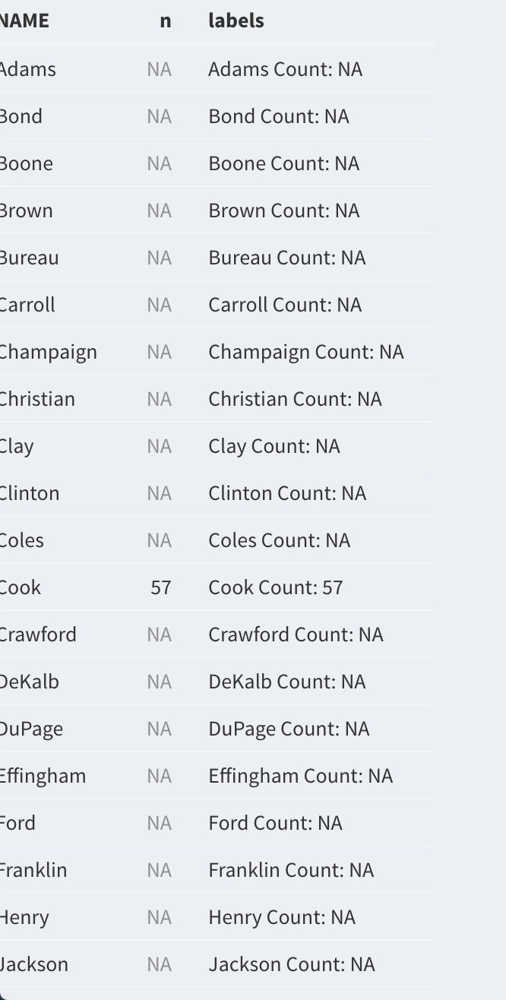

```{r global_options, autosize = TRUE}
```

## Content

- Introduction
- West Nile Virus (WNV) Interactive Map 
- Interactive Shiny App
- Issues
- Conclusion

## Introduction {.build}
> - We chose WNV data of Illinois, which contained information such as race, age, year, and county, that we hoped to integrate into our interactive map and app.

> - The primary goal of our project was to use epidemiological and demographic information, including case count, age, gender, race/ethnicity, and county to map patterns of WNV in Illinois from 2005 to 2012.

> - <span style="font-weight:bold; color:red;">This project fits into the broader scope of WNV research by creating interactive tools to engage the public in the discussion of the prevalence of WNV.</span>

## Interactive map of WNV counts {.build}
> - Prepare raw data (county-level WNV counts, demographic data by case, spatial data per county, merge county counts with spatial data)

> - Merge Illinois WNV and Illinois counties onto blank map highlighted by county name and boundary

> - `leaflet`


## Interactive map of WNV counts in 2005 {.build}
> For example, this is the map of WNV counts in 2005

> <div align="center"></div>

## `Shiny` App

Interactive map with two widgets: year range (2005-2012) and gender


## Technical problems {.build}
> - <div class="blue">Inconsistent leaflet plot rendering</div>

> - Problem: `addPolygons()` 

> - What we tried: changed to `sf` class to `sp`; restarted R Studio; updated versions of all packages and R Studio

> - Solution: changed `crs` to 4326; reordered the merged data frames to ensure that the spatial information was merged to the correct county
  
## Technical problems {.build}
> - <div class="blue">Widgets did not line up</div>

> - Problem: two `box()` widgets that could not fit horizontally with each other

> - What we tried and solution: changed the `box()` function into another `fluidRows()`; reordered the widgets so that the year widget (a slider widget) gets its own row; used HTML code to customize web design

## Technical problems {.build}
> - <div class="blue">Limited data to utilize in the Shiny App</div>

> - Problem: No useful information to display if filtering more than one demographic indicator, due to the small data set

> - Another problem: Column names not recognized when combined into one data frame for use in single-choice demographic widget (age, race, gender)

> - What we tried: Redesigned the UI with HTML injected `radioButtons()` 

> - Solution: chose `choiceNames()` and `choiceValues()` for only one demographic indicator (gender)

## Technical problems {.build}
> - Widget: demographic

> <div align="center"></div>

## Technical problems {.build}
> - Widget choices: gender vs. race vs. age

> <div align="center"></div>

## Technical problems {.build}
> - Problem: Unclear difference between "0" and "NA" for county-level WNV counts

> - What we tried: `expand()` and `full_join` to compare all possible county-year-gender combinations with actual 

> - Lesson learned: Difference between "0" and "NA" matters, and we cannot assume we know which is true

> <div align="center"></div>

## Logistical problems {.build}
> - <div class="blue">1. Hard to find the data and 2. delegate tasks evenly</div>

> - Solution 1: Selected publicly available, state-level data, even though it was less informative than it could have been

> - Solution 2: Delegate tasks to different group members based on availability and preferences, even if it meant one group member did more than another

## Conclusion {.build}
> - Learned how to use `Shiny` for data exploration and information dissemination regarding topics in public health 

> - Visual interactive map and app help the general public to be more engaged in WNV prevention and intervention

> - <span style="font-weight:bold; color:red;">R programming skills into practice</span>